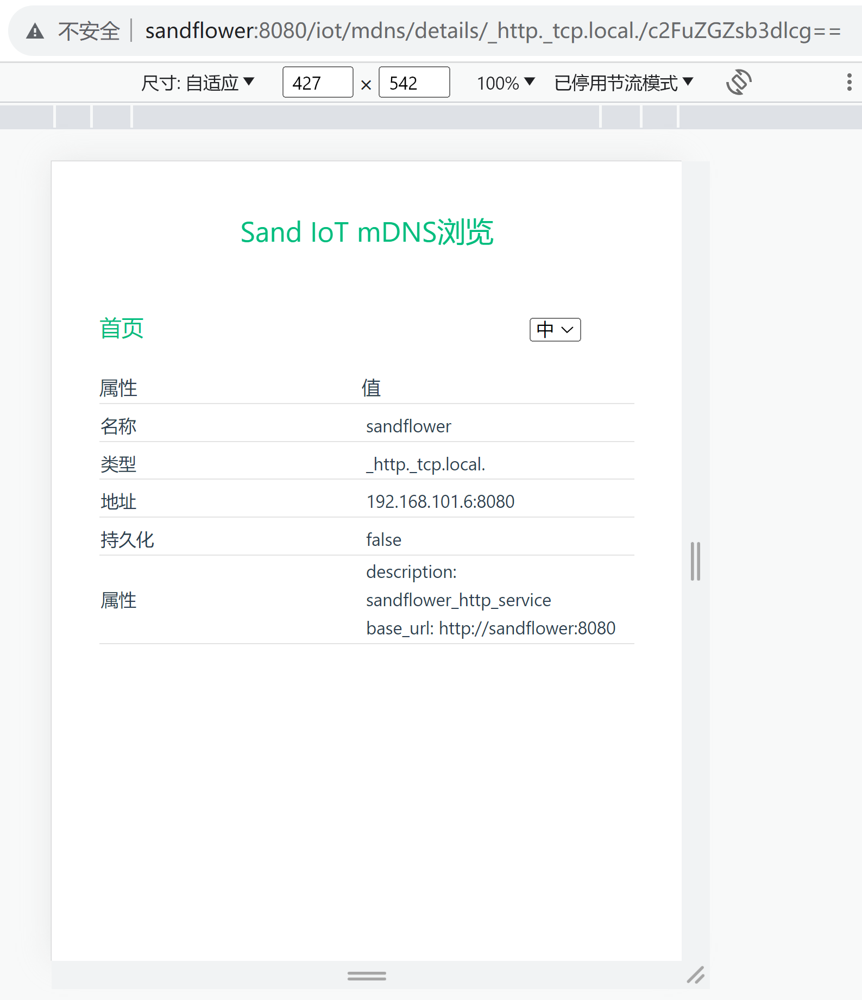

# sand-iot

sand-iot是SandFlower的组成部分，部署在ofbiz-framework的plugins目录下运行。sand-iot提供四个功能：
1. 令OFBiz成为一个MQTT设备，可以接收和执行命令，发布数据
2. 令OFBiz可以向其它MQTT设备发送命令
3. 令家庭局域网设备，通过mdns的网址访问，支持的网址包括：
   sandflower._http._tcp.local.
4. 浏览mdns的页面(http://sandflower:8080/iot/mdns/)：
   
   详情页面：
   
   可以在Home Assistant中添加网页卡片，如下图所示：
   

### 支持的MQTT设备
支持的场景包括：
1. [Rovem](https://github.com/langhua/flower-esp8266/tree/master/docs/zh/retail/rovem)

支持的服务商：
1. [OneNET](https://open.iot.10086.cn/)

### 测试用例
1. Rovem测试用例：
   * 设备数据发布、发布成功/失败消息订阅
   * 通过http向设备发送命令
   * 设备订阅和执行命令，返回执行结果
   * 不同组之间设备隔离，不能发送和接收/订阅消息

### mdns所需配置
1. 修改framework/webapp/config/url.properties，允许访问通过http协议和8080端口，浏览mdns信息：
   ```properties
   no.http=N
   ```

2. 修改framework/security/config/security.properties，允许访问sandflower这个网址：
   ```properties
   host-headers-allowed=localhost,127.0.0.1,demo-trunk.ofbiz.apache.org,demo-stable.ofbiz.apache.org,demo-next.ofbiz.apache.org,sandflower
   ```

### 开发笔记
1. [sand-iot开发笔记](docs/zh/develop.md)
2. [OneNET MQTT开发笔记](docs/zh/onenet-dev.md)
3. [mdns开发笔记](docs/zh/mdns-dev.md)