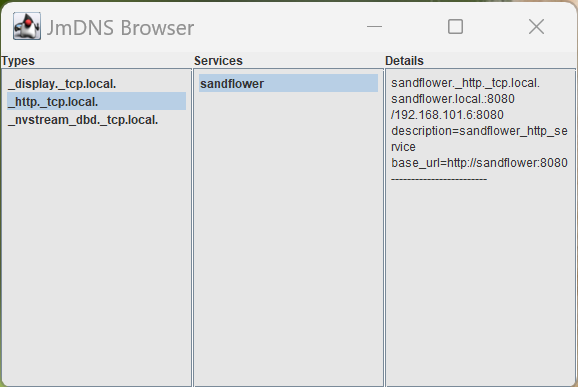
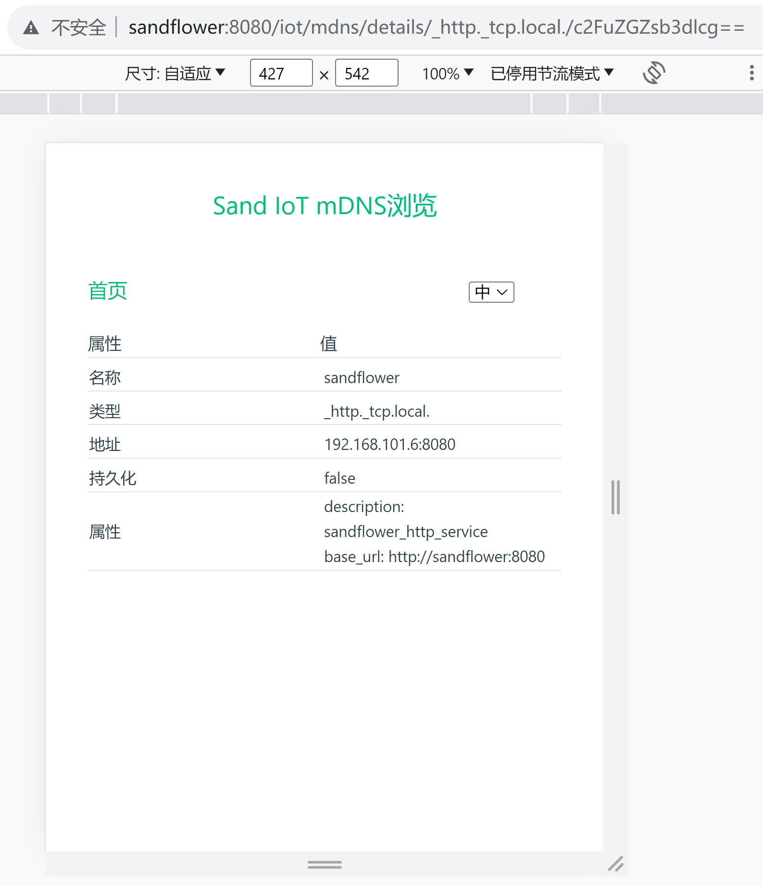
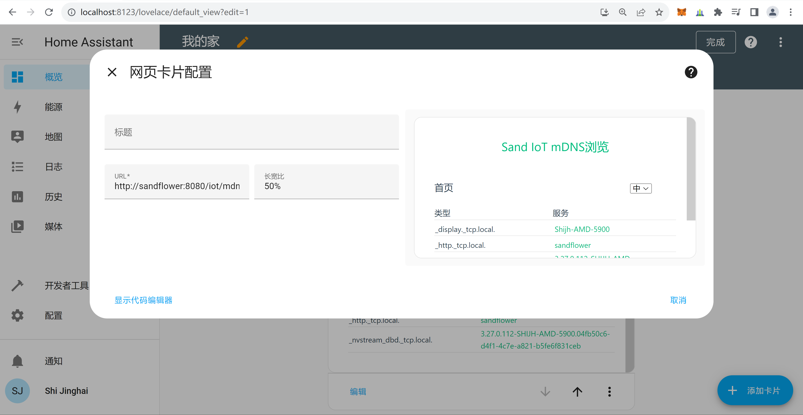
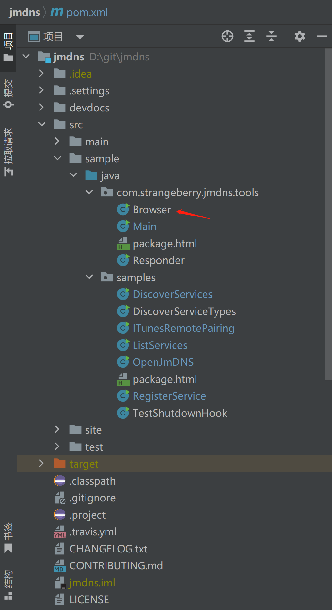
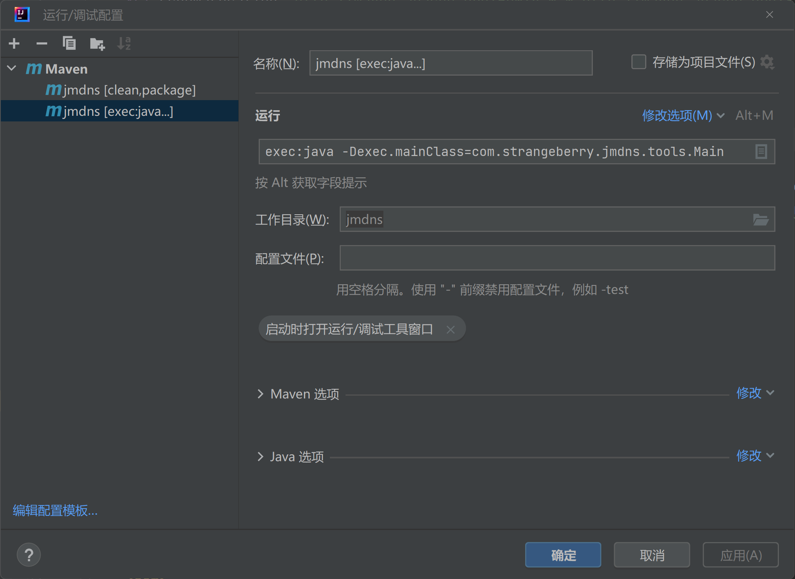

## MDNS开发笔记

sand-iot模块中，mdns的功能：
1. 在启动ofbiz后，生成一个sandflower._http._tcp.local域名。
2. 可以在本地安装的home-assistant中，通过mdns域名，将ofbiz以“网页卡片”方式加入仪表盘。

mdns功能基于[jmdns](https://github.com/jmdns/jmdns)实现，可以理解为把jmdns自带的、基于Java Swing的Mdns Browser，
用vite-vue3又实现了一下。

Jmdns Browser的界面如下：



Sand Iot Mnds页面如下：


详情页面：


Home Assistant中，通过网页卡片添加mdns，如下图所示：


### Jmdns Browser
Jmdns Browser是jmdns源码中自带的，基于Java Swing实现的。缺省情况下，这个Browser不编译，略微修改下即可编译和使用。


下图是在IDEA中配置运行Jmdns Browser：


### Vite-Vue3实现mdns browser
Vite-Vue3代码在vuejs/mdns目录下，推荐在VSCode中打开，进行开发和调试。

开发过程中遇到的问题，主要是因为sand-iot文件夹是软链接引起的，因而配置上需要注意的地方，有两点：
1. 在vite.config.ts中，配置preserveSymlinks: true，否则vite编译时，会报错。

2. 在build.gradle中，要配置workingDir为实际目录，而不是软链接目录，才能编译出正确的vue执行代码：
```groovy
workingDir = file(workingDirPath).toPath().toRealPath().toFile()
```
