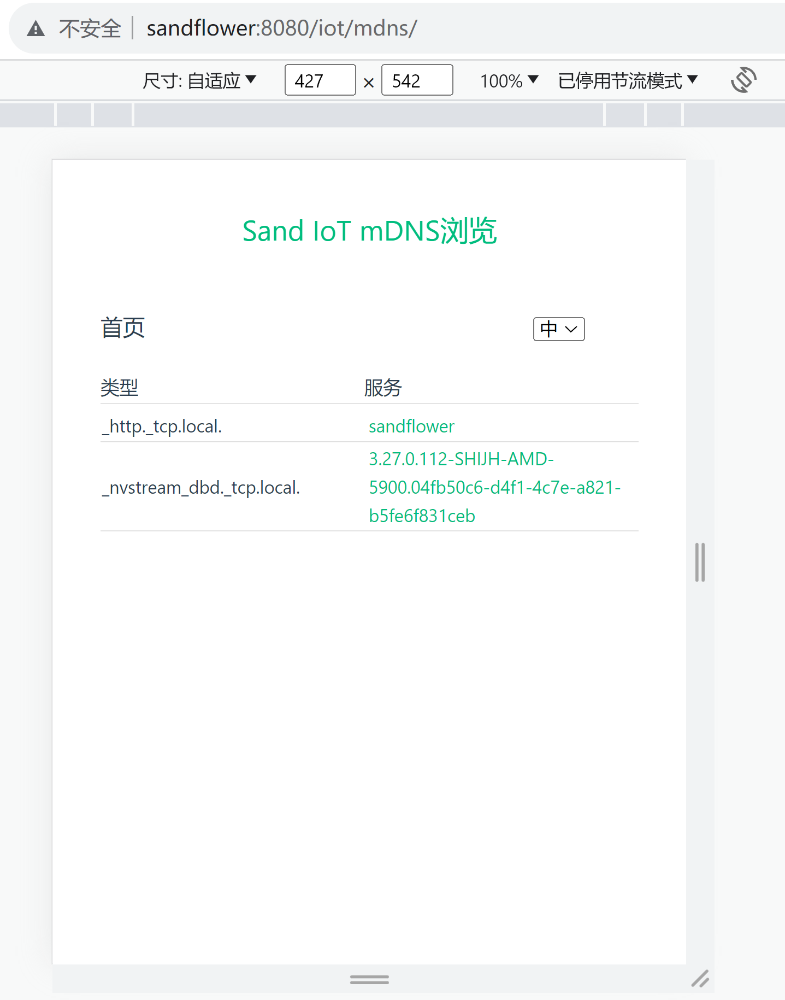

## MDNS开发笔记

sand-iot模块中，mdns的功能：
1. 在启动ofbiz后，生成一个sandflower._http._tcp.local域名。
2. 可以在本地安装的home-assistant中，通过mdns域名，将ofbiz以“网页卡片”方式加入仪表盘。

mdns功能基于[jmdns](https://github.com/jmdns/jmdns)实现，可以理解为把jmdns自带的、基于Java Swing的Mdns Browser，
用vite-vue3又实现了一下。

Jmdns Browser的界面如下：

Sand Iot Mnds页面如下：

详情页面：

Home Assistant中，通过网页卡片添加mdns，如下图所示：

### Jmdns Browser
Jmdns Browser是jmdns源码中自带的，基于Java Swing实现的。缺省情况下，这个Browser不编译，略微修改下即可编译和使用。

下图是在IDEA中配置运行Jmdns Browser：

