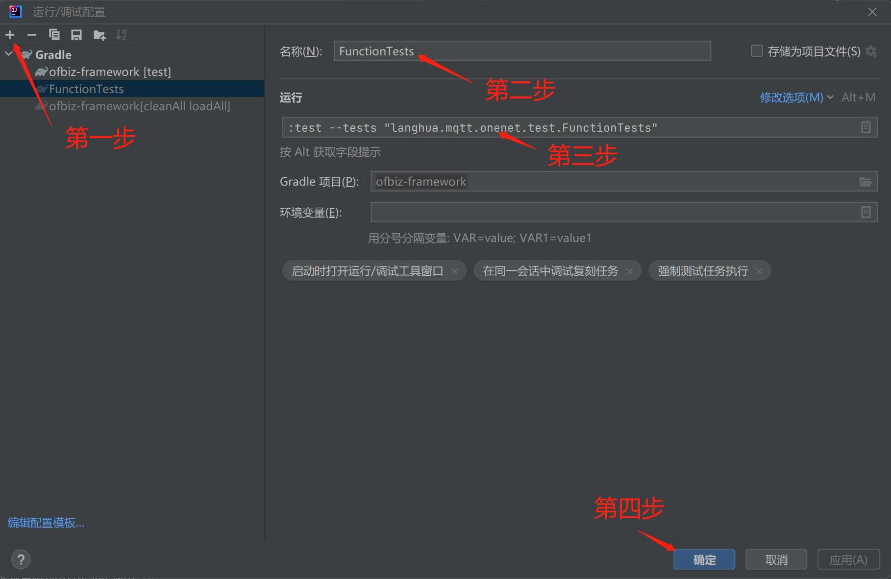
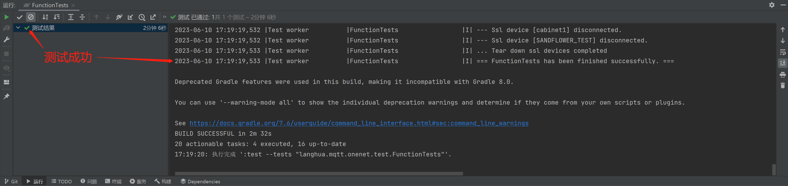
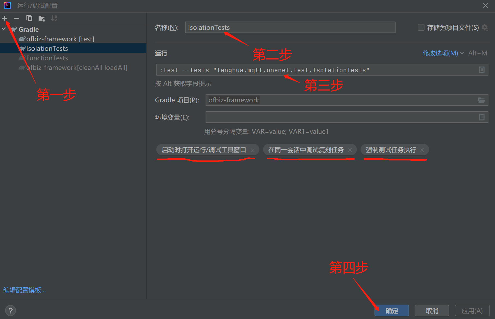
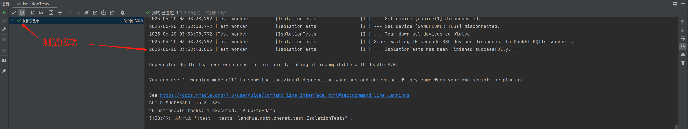

## OneNET MQTT开发笔记

OneNET MQTT文档地址：
https://open.iot.10086.cn/doc/v5/develop/detail/mqtt

OneNET MQTT实现的功能包括：
  * 设备数据发布、发布成功/失败消息订阅
  * 通过http向设备发送命令
  * 设备订阅和执行命令，返回执行结果
  * 不同组之间设备隔离，不能发送和接收/订阅消息

运行FunctionTests测试用例：
1. 如下图所示，新建一个FunctionTests测试用例：
   

2. 运行FunctionTests：
   

运行IsolationTests（隔离）测试用例：
1. 如下图所示，新建一个IsolationTests测试用例：
   

2. 运行IsolationTests:
   